# K3D · 低空无人机综合演练平台

**Unity 6000.5.9f1 · Built-in 渲染管线 · IMGUI · legacy Input · C# 9 · 零第三方插件**

一个面向低空无人机训练的 10 模块综合演练平台:从手工飞行到集群编队,从昼夜天气到监管反制,全部场景由代码过程式搭建(仅地面/立面贴图使用 CC0 素材),开箱即 Play,无需场景文件、无需资源包导入。

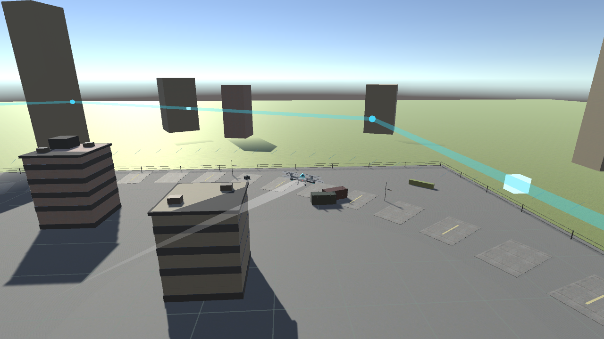

> 上图:模块 3「昼夜与天气适应」白昼默认帧 —— 38° 低角度暖阳长影子、CC0 混凝土/柏油贴图、环形道路+集装箱堆场+围界等工业风场景陈设,全部由代码生成。

## 功能总览(10 大模块)

| # | 模块 | 内容 |
|---|---|---|
| 1 | 手工飞行 | 键鼠/手柄操控,惯性速度模型,俯仰/横滚/偏航/油门,悬停自稳,HUD 实时读数 |
| 2 | 动态航线 | 打点绘制航线、流光线、航点标记、偏差告警、巡航/暂停/续飞/返航 |
| 3 | 昼夜天气 | 白昼/黄昏/夜晚平滑渐变 × 雨/雪/雾/沙尘可调浓度,城市夜灯、湿地反光、风场扰动 |
| 4 | 侦察巡检 | 可见光/红外双视角(热学分级着色+目标描边),扫描波束识别车/人/设备 |
| 5 | 应急战术 | 火情侦察、黑飞喊话驱离、链路失联保护、物资伞降投送(落点/弹跳可量化) |
| 6 | 集群编队 | 9 机(1 领机+8 僚机)楔形/纵队/横队/菱形一键切换,槽位前馈+P 跟随,障碍绕行归位 |
| 7 | 红蓝对抗 | 蓝方锁定充能拦截 vs 红方逃逸 AI,锁定进度圈/拦截/迫降双结局 |
| 8 | 设备故障 | GPS 干扰(定位抖动)/低电量(自动限速)/电机故障(侧倾+停桨+灰烟)/陀螺漂移(偏航),一键解除恢复 |
| 9 | 演练复盘 | 10Hz 全动态体采样,时间轴 Seek 任意回放,已飞轨迹+全程淡线重绘,Op 事件刻度 |
| 10 | 监管反制 | 雷达探测+威胁分级+波次来袭,干扰/捕网/激光三类反制,空域阻断与复位 |

## 运行方式

1. Unity Hub 安装 **Unity 6000.5.9f1**(Built-in 管线,无 URP/SRP 依赖)。
2. `Add → 本仓库目录` → 打开工程,等待编译(无报错)。
3. 打开任意空场景按 **Play**(或直接 Play 默认空场景)—— 平台内核与场景全部由代码在运行时搭建,出现主菜单。
4. 主菜单选择模式(可配时段/天气/风力参数)→ 进入演练。左下角有各模式操作提示,侧板提供该模式的全部交互。

> 无 GUI 依赖:界面全部为 IMGUI(OnGUI),不需要 TextMeshPro / uGUI / Input System / 后处理栈。

## 无头自动验收

全部模块带无头剧本与数值断言,可在 CI/裸机批量验证:

```bash
# 离线编译校验(不启动 Unity,csc + Roslyn)
bash compile-check.sh

# 单模式无头验收(EXIT 0 = 通过,截图与指标落 Screenshots/)
Unity.exe -batchmode -projectPath . -executeMethod DroneSimEditor.SimRunner.SetupAndCapture \
          -dsMode=env -shots=6,34,78 -logFile Logs/env.log

# 10 模式全量回归批
bash v3_batch.sh
```

当前状态:**10 模式 EXIT 0 × 10,全平台断言集 74/74 通过**;断言覆盖飞行建立/收敛/避障/故障现象与恢复/天气粒子与雾密度/夜灯/落点误差/复盘帧数等。

> 注意:`-shots` 的最后时刻之后 SimRunner 会退出,更晚的断言不会触发 —— 做全量覆盖时把采样点拉到剧本末尾(参见 `v3_batch.sh`)。

## 代码结构

```
Assets/Scripts/
├── Core/        PlatformBoot / DrillClock / EventBus / ModeManager / DrillMode / ScenarioRunner / SelfTest
├── Env/         EnvironmentRig / EnvironmentBuilder / MaterialLib / StreetKit / PropKit /
│                DayNightController / WeatherSystem / WindField / CityLights
├── Flight/      FlightBody / PlayerFlightInput / DroneFactory / RotorSpin / FlightAutopilot / RouteFollower
├── Route/       RouteData / RouteVisual / WaypointMarker / DeviationGuide
├── Recon/       ReconCameraRig / ThermalView / ScanPulse / ScannableTarget / RendererRegistry
├── Tactics/     FireSite / SpeakerDeter / IntruderAlert / LinkLoss / SupplyDrop / CivilianTarget
├── Formation/   FormationLibrary / FormationController / FormationHandle / ObstacleAvoid
├── Combat/      RedIntruderAI / BlueInterceptor / LockVisualizer / InterceptWarningFX
├── Faults/      FaultService / FaultEffects
├── Replay/      ReplayService / ReplayPlayer / TrajectoryDrawer
├── Regulator/   RegulatorMode / ThreatGrader / SwarmIntercept / SignalBlockFX / RadarStation …
├── CameraCtrl/  ChaseCamera / RTSCamera / CameraDirector / CameraShake
├── FX/          VFXKit(代码建粒子) / Effects
├── UI/          UIRoot / MainMenuUI / DrillControlBar / StatusBar / EventLog / MarkerOverlay / TimelineUI / PanelKit
└── Modes/       10 个 DrillMode 子类(物件全挂 ModeRoot,切模式整树销毁)
Assets/Resources/Art/Textures/   24 张 CC0 PBR 贴图(双轨:缺图自动回退纯色)
Assets/Editor/SimRunner.cs       无头批处理入口
```

## 实景还原(V1→V3)

| 层 | 内容 |
|---|---|
| V1 材质 | CC0 PBR 贴图(混凝土/砖/金属/柏油/土/草,反照率+法线)+ 程序化天空盒 + 昼夜/黄昏/夜晚大气参数 |
| V2 实物 | 四旋翼无人机(机臂/电机舱/双叶旋翼/云台/滑橇/航空灯)、雷达站、反制炮塔、波纹铁仓库、木托盘物资箱、地面人员、桁架障碍塔、侦察车辆,全部过程式拼装 |
| V3 场景 | 低角度暖阳+2048 软阴影+2 级联、环形道路(标线/路灯)、围界铁网、集装箱堆场、油桶簇、托盘货物、混凝土护栏、绿篱、楼宇幕墙窗带 |

事件语义色(火焰/烟柱/激光/禁区环/轨迹线/警灯)保持 Unlit 自发光,不参与 PBR 光照,确保像素级自动验证稳定。

## 截图

| 手工飞行(全流程后) | 动态航线巡航 |
|---|---|
| 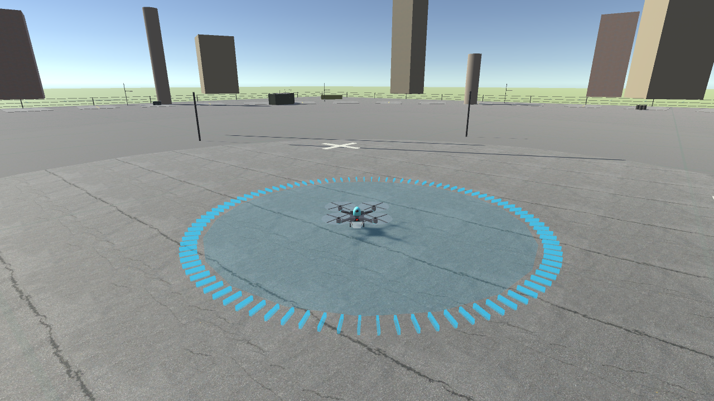 | 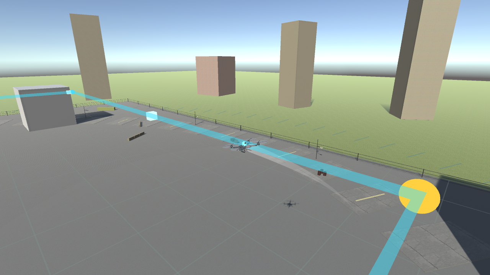 |

| 黄昏 + 雨 | 夜幕降临(城市灯点亮) |
|---|---|
| 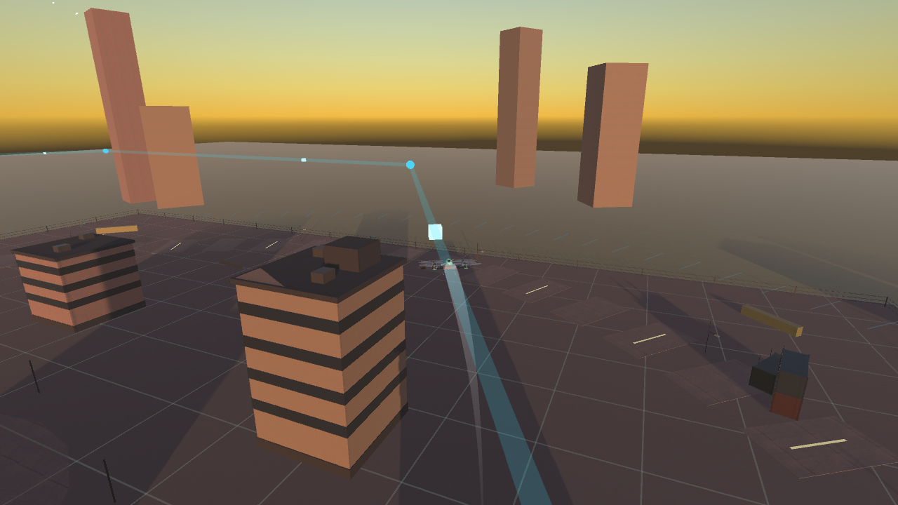 | 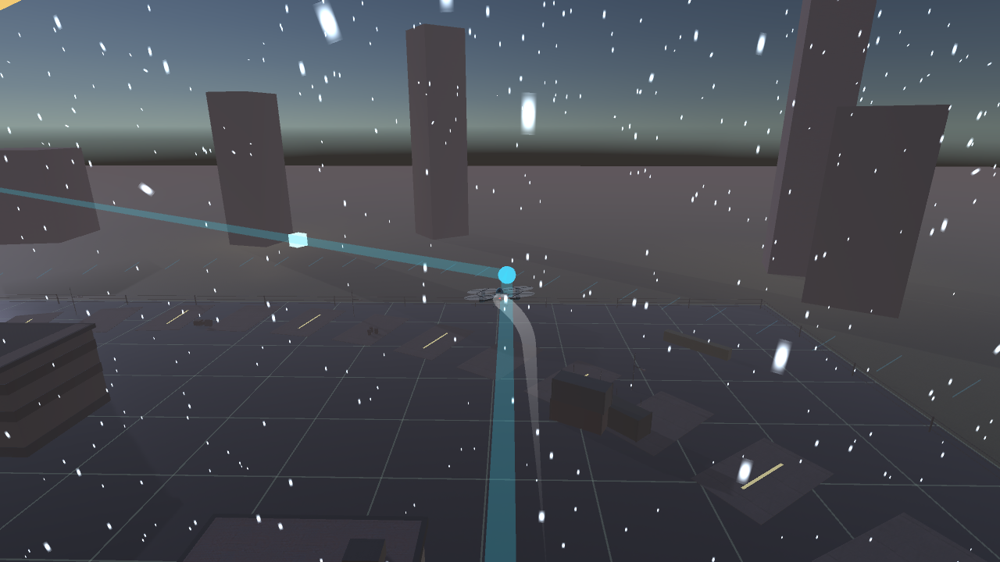 |

| 侦察巡检(目标识别) | 应急战术:喊话驱离 |
|---|---|
| 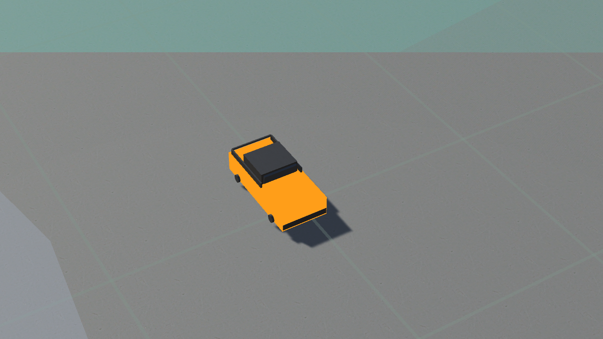 | 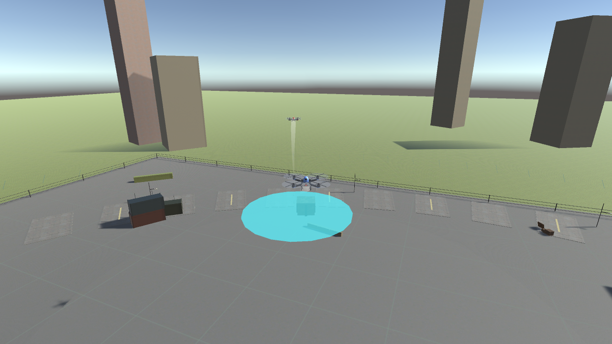 |

| 应急战术:物资伞降 | 红蓝对抗:锁定拦截 |
|---|---|
| 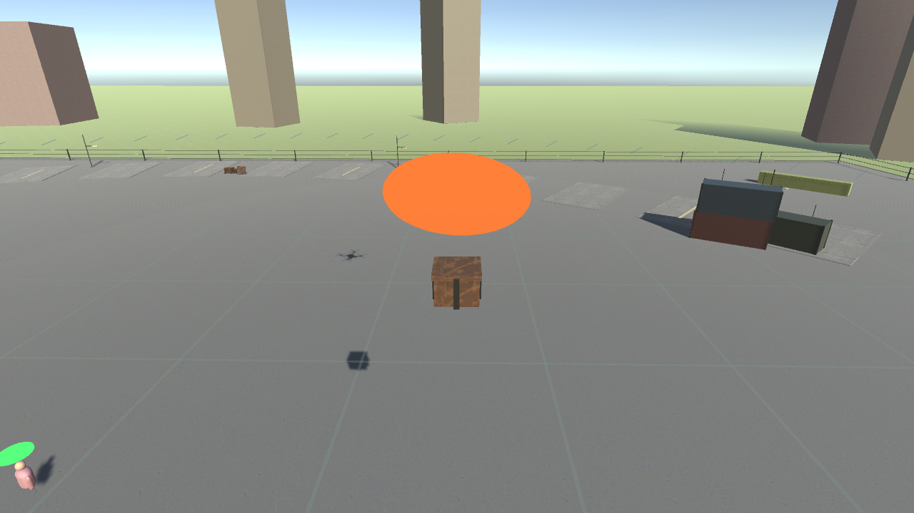 | 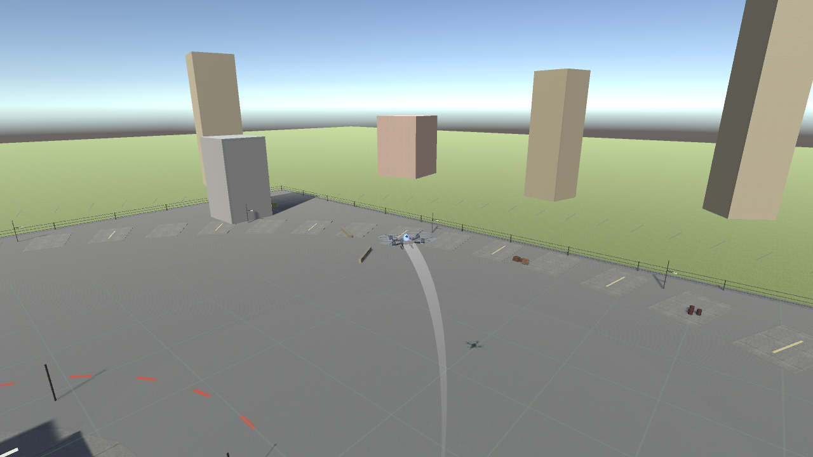 |

| 集群编队(绕行归位) | 设备故障:GPS 干扰 |
|---|---|
| 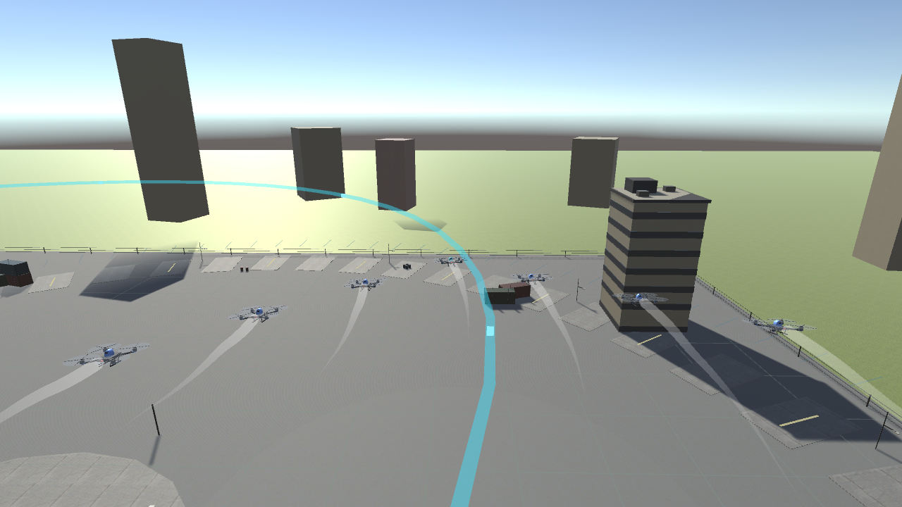 | 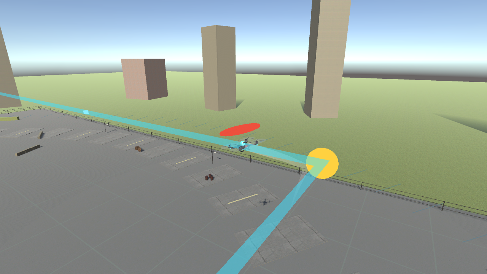 |

| 监管反制(空域防御) | 综合演练 |
|---|---|
| 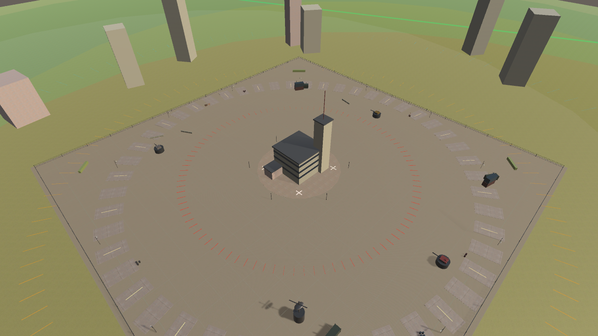 | 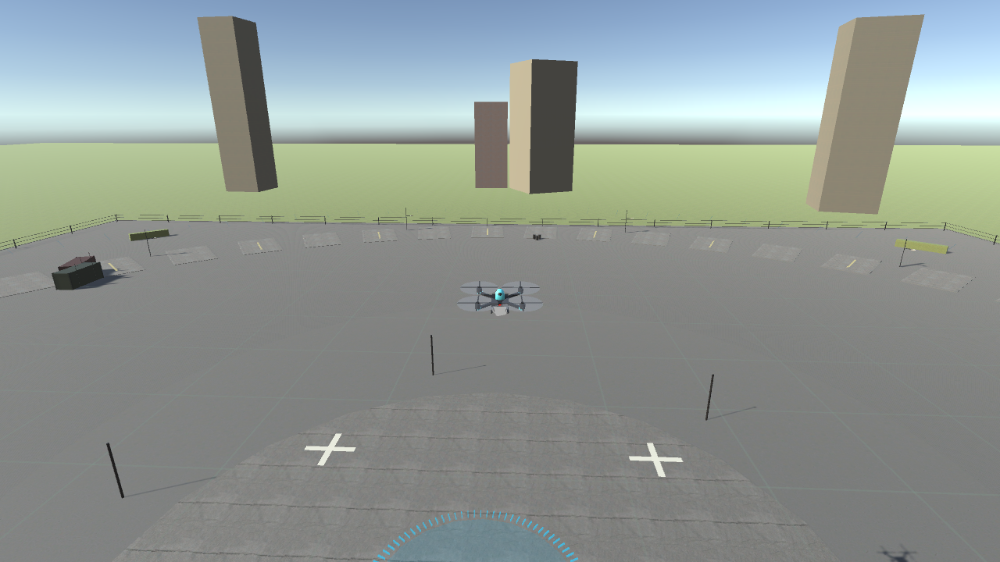 |

> 截图均为 `-batchmode` 无头渲染帧,不含 IMGUI 界面(HUD/侧板请在编辑器 Play 查看)。

## 资源授权

- 贴图:Poly Haven、ambientCG,**CC0**(公有领域),来源清单见 [Assets/Resources/Art/Textures/SOURCES.txt](Assets/Resources/Art/Textures/SOURCES.txt)。
- 代码与过程式模型:本项目自带,无外部许可约束。

## 已知事项

- IMGUI(OnGUI)内容不会出现在无头截屏(引擎行为),UI 验收靠断言 + 编辑器 Play。
- 回放不重放粒子特效(事件点简化重放);4× 倍速下操作类演练手感有衰减。
- 贴图缺失时自动回退纯色材质 —— 最小检出库下功能与断言不受影响,仅观感退回旧版。
